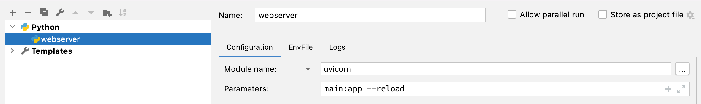
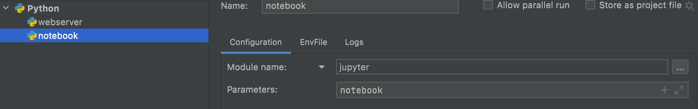

# python-fast-api-ml

## Config to pycharm



## Notebook Config



# Cobertura de codigo atual

**84%**

vamos melhorar sem diminuir.

## Cobertura de codigo

```
coverage run -m pytest
coverage report -m
coverage html
```

abrir o arquivo index.html dentro de htmlcov